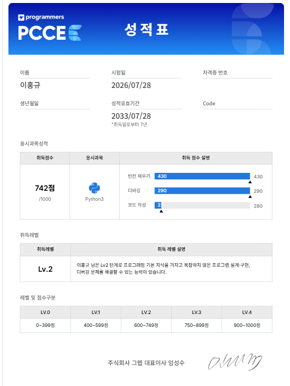

# 🐍 Python Coding Test Study

프로그래머스를 중심으로 Python 코딩테스트를 학습하고, 풀이 과정을 꾸준히 기록하는 저장소입니다.

단순히 정답 코드를 쌓는 것보다 **직접 구현 → 테스트 → 반례 확인 → 디버깅 → 리팩터링** 과정을 반복하며 문제 해결 능력을 높이는 것을 목표로 합니다.

---

## 🚀 Current Progress

| Track | Status |
| --- | :---: |
| 코딩테스트 입문 | ✅ Complete |
| 코딩 기초 트레이닝 | ✅ Complete |
| Programmers Level 0 | ✅ Complete |
| PCCE | ✅ Lv.2 · 742 |
| Programmers Level 1 | 🔄 In Progress |
| PCCP 유형 학습 | 🔄 In Progress |

---

## 🏅 PCCE

**PCCE Lv.2 · 742 / 1000**

- 빈칸 채우기: **430점**
- 디버깅: **290점**
- 코드 작성: **22점**

<p align="center">
  
</p>

첫 PCCE 결과를 현재 위치를 확인하는 기준점으로 삼고, 이후에는 **직접 코드 작성 능력과 제한 시간 내 구현 능력**을 집중적으로 보완하고 있습니다.

---

## 🏆 Level 0 Complete

프로그래머스의 **코딩테스트 입문**과 **코딩 기초 트레이닝**을 모두 완료했습니다.

### 코딩 기초 트레이닝

<p align="center">
  
</p>

### 코딩테스트 입문

<p align="center">
  
</p>

---

## 🔍 How I Study

문제를 처음부터 정답 풀이를 보고 따라가기보다 **먼저 직접 구현하는 것**을 우선합니다.

```text
문제 이해
   ↓
직접 풀이
   ↓
제출 / 테스트
   ↓
실패한 케이스 확인
   ↓
반례 분석
   ↓
리팩터링
   ↓
다른 풀이와 비교
```

정답 여부뿐 아니라 다음 내용까지 함께 확인합니다.

- 놓친 조건과 경계값 확인
- 실패한 테스트케이스 원인 분석
- 불필요한 반복 제거
- 더 적절한 자료구조가 있는지 검토
- 시간복잡도 확인
- Pythonic한 풀이와 비교

---

## 🧠 What I'm Learning

### Python

`String` · `List` · `Dict` · `Set` · `Tuple` · `Slicing` · `enumerate` · `zip` · `lambda` · `sorted`

### Problem Solving

`Implementation` · `Simulation` · `Brute Force` · `Stack` · `Greedy` · `2D Array` · `String Processing`

---

## 🎯 Current Focus

Level 0 완주 이후 다음 단계에 집중하고 있습니다.

- Programmers Level 1 문제 풀이
- PCCE 코드 작성형 보완
- PCCP 유형 문제 연습
- 제한 시간 안에서 구현 마무리
- 디버깅 속도 개선
- 경계값과 반례 확인 습관화

---

## ⚙️ Repository

- **Platform**: Programmers
- **Language**: Python
- **Auto Upload**: BaekjoonHub
- **Purpose**: Coding Test / Algorithm Study

정답 제출 후 [BaekjoonHub](https://github.com/BaekjoonHub/BaekjoonHub)를 통해 풀이가 자동 커밋됩니다.

## 📁 Repository Structure

```text
python/
├── 프로그래머스/
│   └── {level}/
│       └── {problem}/
├── docs/
│   └── assets/
└── README.md
```

문제별 디렉터리에는 BaekjoonHub가 생성한 문제 정보와 제출 코드가 저장됩니다.

---

## 참고

- 각 풀이 코드는 개인 학습 기록입니다.
- 문제 설명과 예시는 각 코딩 테스트 플랫폼의 이용 조건과 권리에 따릅니다.
- 자동 업로드가 중단되면 BaekjoonHub의 GitHub 연결 상태를 먼저 확인합니다.

---

**Keep solving. Keep improving. 🐍**
